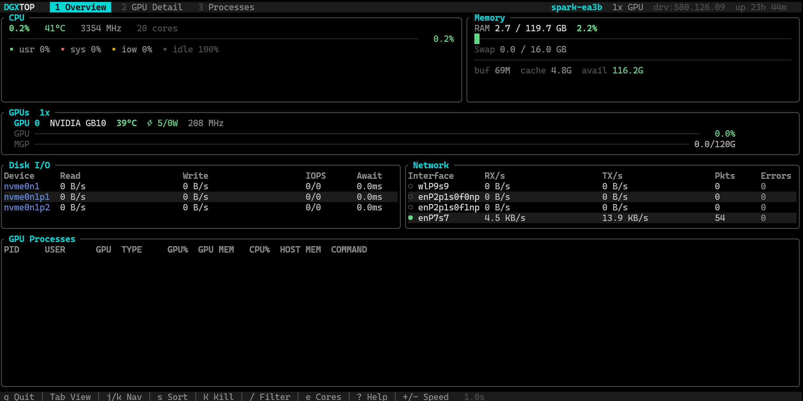
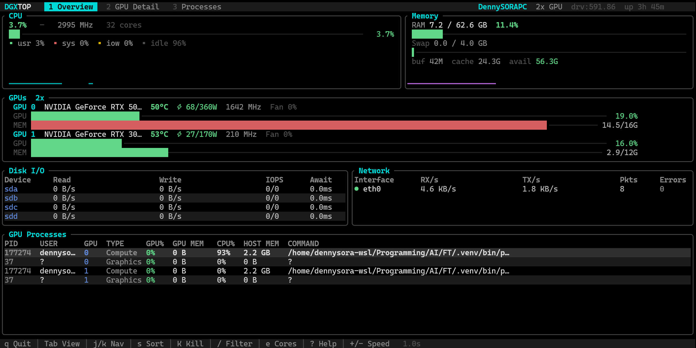
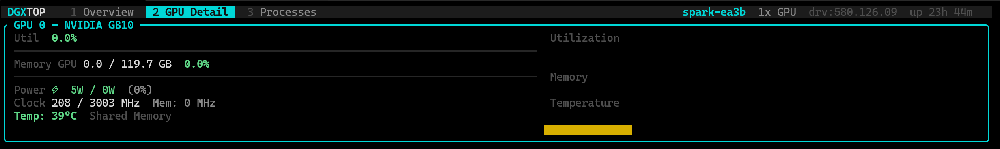
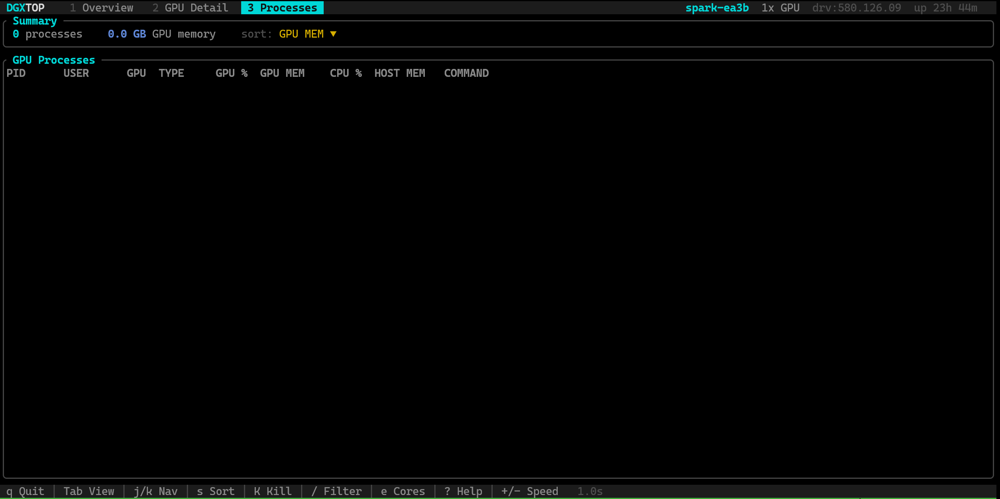

# dgxtop



[繁體中文](docs/README.zh-TW.md) | [简体中文](docs/README.zh-CN.md) | [日本語](docs/README.ja.md)

> High-performance, interactive system monitor for NVIDIA DGX systems with real-time GPU, CPU, memory, disk, and network monitoring.

[](LICENSE)
[](https://www.rust-lang.org/)
[](https://github.com/DennySORA/dgxtop/actions/workflows/ci.yml)
[](https://github.com/DennySORA/dgxtop/releases)

**dgxtop** is a comprehensive system monitoring tool purpose-built for NVIDIA DGX infrastructure. It provides real-time visibility into GPU utilization, VRAM, temperature, power draw, NVLink topology, and system resources — all in an interactive terminal UI. Built in Rust with direct NVML access for maximum performance and reliability.

## Quick Install

```bash
curl -fsSL https://raw.githubusercontent.com/DennySORA/dgxtop/main/install.sh | bash
```

See [Installation](#installation) for more options.

## Why dgxtop?

- **Direct NVML Access** — Reads GPU metrics through NVIDIA Management Library, not nvidia-smi subprocess calls. Faster, more reliable, and more detailed.
- **DGX-Optimized** — Supports multi-GPU monitoring, NVLink topology, ECC error tracking, and PCIe throughput — features critical for DGX A100/H100/B200 and DGX Spark.
- **Full System View** — CPU per-core utilization, memory (RAM + Swap), disk I/O (IOPS, latency, throughput), and network interfaces in a single dashboard.
- **Interactive Process Management** — Sort, filter, and kill GPU processes directly from the TUI. See per-process GPU utilization, VRAM usage, and host memory.
- **Secure by Design** — No subprocess shell-outs, PID recycling protection, config value sanitization, and UTF-8 safe rendering. Passed deep security audit.

## Features

### GPU Monitoring (via NVML)

| Category | Metrics |
|----------|---------|
| **Utilization** | GPU %, Memory %, per-process SM utilization |
| **Memory** | VRAM used/total/free, per-process GPU memory |
| **Thermal** | Temperature, fan speed |
| **Power** | Draw/limit (watts), usage percentage |
| **Clock** | Graphics frequency, memory frequency, max frequency |
| **Health** | ECC errors (corrected/uncorrected), PCIe throughput |
| **Topology** | NVLink active links, remote GPU mapping |

### System Monitoring

| Category | Metrics |
|----------|---------|
| **CPU** | Aggregate and per-core usage, user/system/iowait breakdown, temperature, frequency |
| **Memory** | RAM used/total, buffers, cached, available, swap usage |
| **Disk I/O** | Per-device read/write throughput, IOPS, await latency, queue depth |
| **Network** | Per-interface RX/TX throughput, packet rates, errors, dropped packets |

### Interactive TUI

- **Three Views** — Overview dashboard, GPU detail with history charts, full-screen process table
- **Vim Keybindings** — Navigate with `j/k`, switch tabs with `1/2/3`, GPU selection with `h/l`
- **Process Management** — Sort by GPU mem/utilization/CPU/PID, filter by name, kill with confirmation
- **Visual Design** — Rounded panels, gradient gauges with half-block precision, sparkline history, alternating row colors, color-coded thresholds

#### Multi-GPU Overview with Active Workloads



## Installation

### Quick Install (Recommended)

```bash
curl -fsSL https://raw.githubusercontent.com/DennySORA/dgxtop/main/install.sh | bash
```

The installer auto-detects your libc and picks the matching release target.
For NVIDIA GPU metrics, glibc (`-gnu`) builds are recommended.

### Download Binary

Download pre-built binaries from [GitHub Releases](https://github.com/DennySORA/dgxtop/releases):

| Platform | Architecture | Download |
|----------|--------------|----------|
| Linux | x86_64 (glibc, recommended) | `dgxtop-x86_64-unknown-linux-gnu.tar.gz` |
| Linux | x86_64 (musl, compatibility) | `dgxtop-x86_64-unknown-linux-musl.tar.gz` |
| Linux | ARM64 (glibc, recommended) | `dgxtop-aarch64-unknown-linux-gnu.tar.gz` |
| Linux | ARM64 (musl, compatibility) | `dgxtop-aarch64-unknown-linux-musl.tar.gz` |

> Note: On some systems, musl builds may fail to load NVIDIA NVML (`libnvidia-ml.so`), resulting in missing GPU metrics.

### Build from Source

```bash
git clone https://github.com/DennySORA/dgxtop.git
cd dgxtop
cargo build --release
# Binary: target/release/dgxtop
```

### Cargo Install

```bash
cargo install --git https://github.com/DennySORA/dgxtop.git
```

## Usage

### Basic Usage

```bash
# Start with default settings
dgxtop

# Custom refresh interval (0.5 seconds)
dgxtop -i 0.5

# Disable GPU monitoring (system metrics only)
dgxtop --no-gpu

# Use green color theme
dgxtop -t green
```

### Command Line Options

| Option | Description | Default |
|--------|-------------|---------|
| `-i, --interval <SECS>` | Update interval in seconds (0.1–10.0) | `1.0` |
| `-t, --theme <NAME>` | Color theme: `cyan`, `green`, `amber` | `cyan` |
| `--no-gpu` | Disable GPU monitoring | `false` |
| `--log-level <LEVEL>` | Log level: `error`, `warn`, `info`, `debug` | `warn` |

### Keyboard Shortcuts

| Key | Action |
|-----|--------|
| `q` / `Ctrl+C` | Quit |
| `Tab` / `Shift+Tab` | Switch between views |
| `1` / `2` / `3` | Jump to Overview / GPU Detail / Processes |
| `j/k` or `↑/↓` | Navigate up/down |
| `h/l` or `←/→` | Select GPU (in GPU Detail view) |
| `s` | Enter sort mode |
| `r` | Reverse sort order (in sort mode) |
| `/` | Filter processes by name/PID/user |
| `K` | Kill selected process (with confirmation) |
| `e` | Toggle per-core CPU display |
| `+` / `-` | Increase / decrease refresh speed |
| `?` | Toggle help overlay |

### Views

**Overview** — Compact dashboard with CPU gauge, memory bars, GPU cards, disk I/O table, network table, and process list. All key metrics at a glance.

**GPU Detail** — Per-GPU cards with detailed metrics (utilization, VRAM, power, clock, temperature, ECC, PCIe) and history sparkline charts for utilization, memory, and temperature.



**Processes** — Full-screen GPU process table with sortable columns, search filter, and process kill capability. Shows PID, user, GPU device, type, GPU%, VRAM, CPU%, host memory, and command.



## Architecture

```
┌─────────────────────────────────────────────────────────────────────┐
│                           Main Thread                               │
│  ┌───────────┐    ┌────────────┐    ┌────────────────────────────┐ │
│  │  AppState  │◄───│  UI Loop   │◄───│ crossbeam channel (rx)    │ │
│  │            │    │  (ratatui) │    │ bounded(256)               │ │
│  └───────────┘    └────────────┘    └────────────────────────────┘ │
└─────────────────────────────────────────────────────────────────────┘
                                                ▲
                     Tick events + Key/Mouse    │
                                                │
┌───────────────────────────────────────────────┴─────────────────────┐
│                        Event Thread                                  │
│  ┌───────────────────────────────────────────────────────────────┐  │
│  │  crossterm::event::poll + Tick timer → AppEvent → channel tx  │  │
│  └───────────────────────────────────────────────────────────────┘  │
└─────────────────────────────────────────────────────────────────────┘

Collectors (called on each Tick):
  ├── GpuCollector        (NVML: utilization, temp, power, clock, memory, ECC, PCIe)
  ├── GpuProcessCollector (NVML + /proc: per-process GPU/CPU/memory stats)
  ├── CpuCollector        (/proc/stat: per-core usage, frequency, temperature)
  ├── MemoryCollector     (/proc/meminfo: RAM, swap, buffers, cached)
  ├── DiskCollector       (/proc/diskstats: per-device throughput, IOPS, latency)
  └── NetworkCollector    (/sys/class/net: per-interface RX/TX, packets, errors)
```

## Requirements

- **OS**: Linux (DGX systems, WSL2, containers)
- **GPU**: NVIDIA drivers with NVML (libnvidia-ml.so)
- **Runtime**: No additional dependencies. For GPU monitoring, prefer glibc (`-gnu`) builds.

## Security

dgxtop has undergone a comprehensive security audit addressing:
- UTF-8 boundary safety in all string rendering
- PID recycling protection with pre-kill verification
- Integer overflow protection with saturating arithmetic
- Path traversal prevention in filesystem readers
- Config value sanitization against NaN/Infinity/DoS
- Bounded event channels to prevent memory exhaustion

See commit history for the full audit report and fixes.

## License

Apache License 2.0 — see [LICENSE](LICENSE) for details.

## Contributing

Contributions welcome! Please feel free to submit issues and pull requests.
